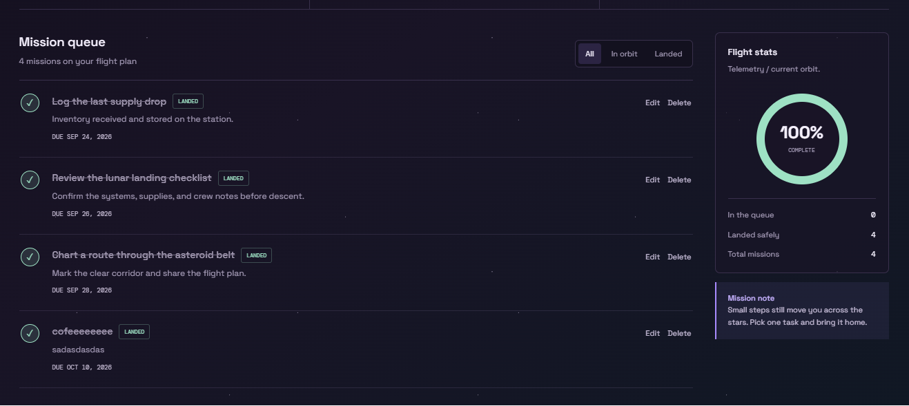
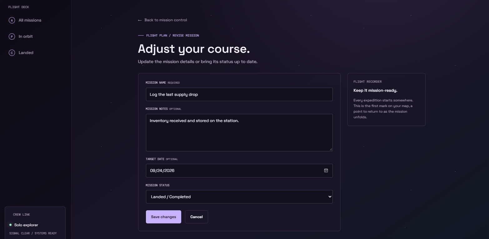

# Orbital Task Manager

A small Laravel task manager styled as a violet-toned astronaut mission console. Tasks support notes, optional target dates, pending/completed status, filtering, editing, and deletion.

## Project Details

- **Project Code:** WST21-PM-2026-SF
- **Student Name:** Polaris Cylurks J. Parba
- **Course & Year:** BSIT-2
- **Database Used:** SQLite

## Features

- Add tasks
- View and filter tasks
- Edit tasks
- Delete tasks
- Update task status


## Screenshot walkthrough

The screenshots below show the typical workflow for creating and managing a mission in Orbital.

### 1. Open Mission Control


Start on the Mission Control dashboard. Review the mission totals, flight-plan progress, and current mission queue, then select **New mission** to add a task.

### 2. Enter the mission details



On the New Mission page, enter a **Mission name**. You can also add optional **Mission notes** and a **Target date** to provide more context for the task.

### 3. Add the mission to the flight plan


Review the information you entered, then select **Add to flight plan**. Orbital saves the mission and returns you to Mission Control, where the new task appears in the queue.

### 4. Track and manage the mission



Use the mission queue to manage the saved task. Select the completion control to mark it as **Landed**, use **Edit** to change its details, or use **Delete** to remove it. The **All**, **In orbit**, and **Landed** filters help you focus on the missions you need to see.

## Tests

```sh
php artisan test --compact
```